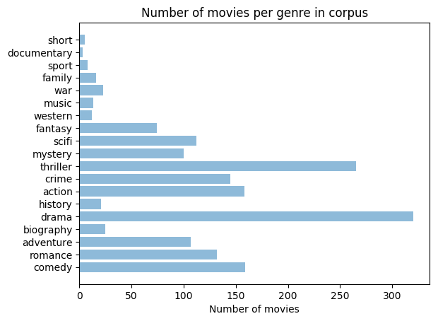
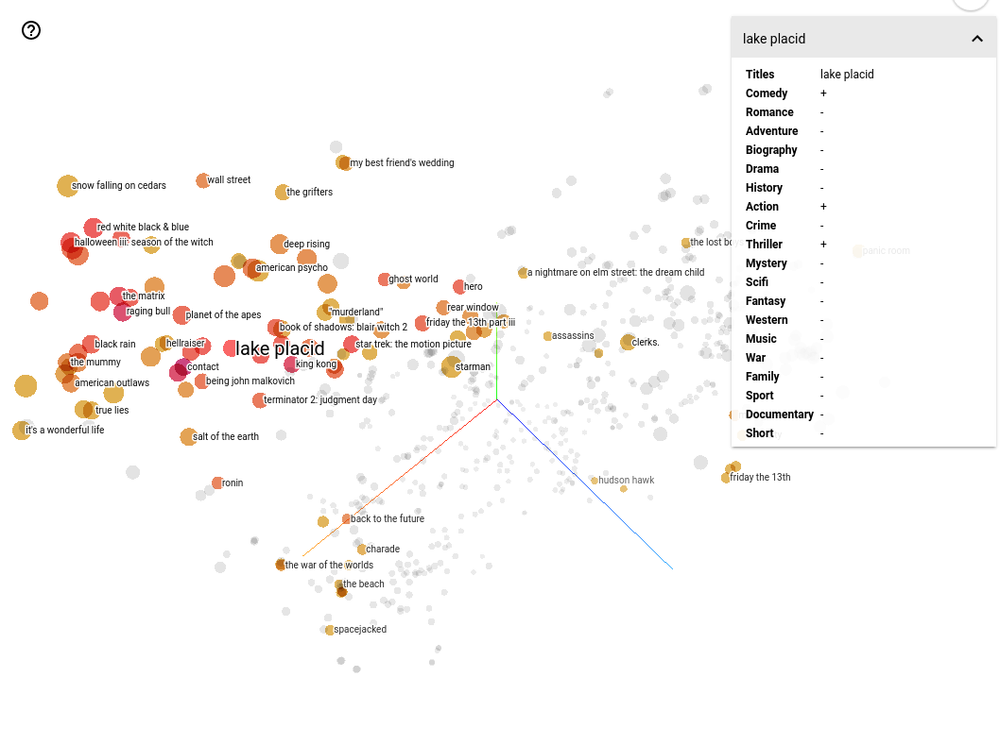

Machine Learning Engineer Nanodegree
====================================

Capstone Project
----------------

Tyler Shumaker  
September 21st, 2017

I. Definition
-------------

### Project Overview

I am currently working on a project to develop a proof of concept implementation of intelligent virtual agents that will provide virtual personal assistant, recommendations, and product socializing capabilities to an user. The users will interact with the intelligent agents via chat, using an open source webchat platform as the interface to the chat bot. One of the jobs being performed in the background by the intelligent agents is to provide recommendations to the users. We intend to recommend chat rooms to users they should consider joining.

Providing recommendations based off of chat discussions has been used to provide complementary information. Recommendation of Complementary Material during Chat Discussions [1] provided recommendations of electronic documents and links to web pages to enable collective and personal learning. This proposed system performed text mining on each message posted to a chat program and compared words in the message to terms in a domain ontology. Terms identified in the message were then passed to a Recommender module where items classified with those terms were then recommended. This proposed system is similar to what we are trying to achieve but we will be recommending chat rooms that represent an area of interest.  
Ex. Chat room titled "Ocean City, MD" will be used for users to chat about Ocean City, Maryland. So users chatting about terms like "Ocean City" and "Maryland" will be recommended to join the "Ocean City, MD" chat room.  
 \* Details of the project are intentionally vague in this proposal because the work is on-going.

### Problem Statement

A common problem for our clients is that users spend a lot of time finding a subject-matter expert (SME) or relevant information to assist them complete their tasks. Based upon the user's interaction with the chat bot and other users we want to be able to recommend chat rooms where other users are working on similar topics. Users are able to chat with other users in public chat rooms, private chat rooms and direct messages. No communication via private chat rooms or direct messages will be used for recommendations. Users can also interact with the chat bot via direct message and in public chat rooms by starting a message with the chat bot's handle. Ex. @chatbot

All communication between a user and the chat bot will be captured as conversations because the system is designed for the chat bot to perform actions for the user that are relevant to their tasks. Ex. @chatbot search google for "vacation destinations in Maryland" which the chat bot will respond with a list of links to the top 10 responses of a Google search of the search term. Continuous chat exchanges (separated by 30 minutes of inactivity) between multiple users in a public chat room will be recorded as a conversation. The system allows for chat rooms to have titles ("Ocean City, MD") but also associated topics of interest such as "Vacation", "Ocean", and "Maryland" to that chat room. Users will be given recommended chat rooms at predetermined intervals (daily) or when requested from the chat bot (@chatbot get recommended chat rooms). The recommendations will be returned by the chat bot via a direct message to the user.

All of the chat communication from each chat room will be converted to vectors using a word embedding model, Doc2Vec (specifically the “distributed memory” (dm) algorithm ) [3]. "Doc2vec (aka paragraph2vec, aka sentence embeddings) modifies the word2vec algorithm to unsupervised learning of continuous representations for larger blocks of text, such as sentences, paragraphs or entire documents." [4] The vectors from the all of the chat rooms will be used to train the model and the conversations of individual users will be also converted to vectors using Doc2Vec. The individual users vector will be inferred to the training corpus and return the rank of the training documents based on self-similarity. The system will return the top 5 chat rooms returned from user's conversation inferred vectors.

### Metrics

To evaluate this solution the similarities in recommendations for a user (A) and a user that has a conversation with user (A) in a chat room (B) will be compared to the to the similarities in recommendations for user (A) and a random user (C). Ex. The recommendations for "user A" and "user B" whom had conversations in "chat room 1" should be more similar then the recommendations for "user A" and the "user C" who has never chatted in "chat room 1".

II. Analysis
------------

### Data Exploration

The Cornell Movie-Dialog Corpus [2] will be used because it is a collection of conversations extracted from movie scripts. The dataset consist of 220,579 conversational exchanges between 10,292 pairs of movie characters involves 9,035 characters from 617 movies. Each character can be treated as a user in a chat platform and each movie can be related to chat rooms or channels. The movie scripts were gathered from publicly available scripts that are referenced in the raw_scripts_urls file. The metadata for the movies were gathered from IMDB. The corpus consist of a movie_titles_metadata file that provides; movieID, movie title, movie year, IMDB rating, no. IMDB votes and genres. The movie_characters_metatadata, movie_lines, movie_conversations and movie_titles_metadata files can be can be used to construct the conversations between movie characters.

Characters from the movie corpus are equivalent to users in our chat system and movies will be equivalent to chat rooms. With the movie corpus data I will be recommending movies (chat rooms) to movie characters (users). In our application the users and chat rooms can be associated with topics of interests which will be managed by users. The associated topics of interest are not a reliable means of providing recommendations because it requires the users to populate this data.  
Users may not associate any topics or incorrectly assign topics to chat rooms.

All of the movie lines from each movie will be converted to vectors using Doc2Vec. The movies from the Cornell Movie-Dialog Corpus will be used to train the model and the conversations of individual characters will be used to test the model. It should be easy determine if the model is performing correctly if a vector for a movie returns the highest rank for itself (if a character is from "movie A", then "movie A" should return a high rank). The model then be tested against random movies and characters from the test corpus and compared by eye. The top 5 movies returned from character conversation inferred vectors will be used for assessment.

### Exploratory Visualization

The bar chart below shows the number of movies per genre in the Cornell Movie-Dialog Corpus. Most of the movies are categorized in multiple genres. If a movie has multiple genres it is included in the count for each genre.

Figure 1: Number of movies per genre in the Cornell Movie-Dialogs Corpus

A genre is a movie category based on similarities in either the narrative elements or the emotional response to the film. Knowing the genres of the movies allows for a sanity check when comparing recommendations during testing. This chart shows that there are a large number of genres represented in the corpus. Some genres are represented by a hundreds of movies like 'thriller' and 'drama'. Other genres like 'war', 'western' and 'sport' are only represented by a few movies. One possible hypothesis is that a character from a movie that is categorized as a genre should recommend other movies with the same genre because of the context of the movie lines.

### Algorithms and Techniques

The conversational chat data from chat rooms and individual users results in large sets of textual data. A transcript of chat data is most comparable to a document. Doc2Vec allows for a numeric representation of these chat data documents. Doc2Vec is build on Word2Vec which is a word embedding model that represents words as a learning vector. [7] The Doc2Vec distributed memory version of the Paragraph (PV-DM) algorithm takes the Word2Vec Continuous Bag-of-Words (CBOW) algorithm which predicts words from the source context words and adds a unique document feature vector. The resulting document vector represents the concept of the document.

The Doc2Vec model is instantiated with a vector size of 30 words and iterating 20 times over the training corpus. The PV-DM training algorithm is the default algorithm used with gensim Doc2Vec. Different vector size, number of iterations and minimum word count (will give higher frequency words more weight) will be tested to see if increases in those parameters improve results while assessing the model

Doc2Vec will allow the movie lines from each movie in the Cornell Movie-Dialog Corpus, which will be used to represent a chat room's chat data, to be represented as vectors. The conversations of individual characters (users) from the corpus will also be represented as vectors and interfered into the model to calculate the similarity of the character's conversations to the lines of each movie. The movies (chat rooms) that are most similar will be recommended to the character (user) as movies (chat rooms) they could be interested in joining.

### Benchmark

A content-based recommendation system will be used a benchmark model. TF-IDF (Term Frequency - Inverse Document Frequency) will be used to parse of the movie lines for each movie and all of the conversations for the character which is being tested. Cosine similarity will be used to determine which conversations are closest to each other. [6] The movies that the highest cosine similarity to a characters conversation will be recommended. The recommendation of the Doc2Vec approach will be compared to the results of the content-based recommendation system by comparing the text of the of the recommended movies by eye.

III. Methodology
----------------

### Data Preprocessing

The Cornell Movie-Dialog Corpus files need to be parsed to create the text documents needed for training and testing of the model. The fields in the files are separated by " +++$+++ ". To create the document representation of all the lines from each movie the movie_lines.txt will be parsed. The movie_id field will be used as the keys in the dictionary. All the lines for each movie will be converted to list of tokens using the gensim simple pre-processing tool [8](tokenize
text into individual words, remove punctuation, set to lowercase, etc) will be used as the value.

To create the document representation of each characters conversations the movie_conversations.txt will be parsed. The fields of this file are the characterID of the first character involved in the conversation, characterID of the second character involved in the conversation, movieID of the movie in which the conversation occurred and list of the utterances that make the conversation (in chronological order). To reconstruct the actual lines the utterances have to be matched to the movie_lines.txt file. A python dictionary will need to be created from the movie_lines.txt file pairing each line_id to the content. A character conversation dictionary will be create where each character_id will be used as the keys with all of the lines from that characters conversations (spoken and spoken by character conversing with) will be used as the value which will also be converted using the gensim simple pre-processing tool.

The training corpus will be created from the movie lines dictionary and the testing corpus will be created from the individual characters conversation dictionary. The corpus will be list of TaggedDocument objects where each entry from the dictionaries will be used to create a TaggedDocument with the tokenized text will be the words and the movie_id or character_id as the tag.

### Implementation

Dictionaries were used when parsing the movie corpus data to allow for movie and character ids to be mapped with textual content via the key - value association. The movie lines dictionary was created by looping over all the entries in the movie_lines.txt file, splitting the line on the ' +++$+++ ' field separator and ensuring the appropriate number of fields were found. An if statement to check if the movie_id field already existed as a key in the dictionary will result in the value being set to the value of the existing set plus the new content. If the movie_id was no found in as a key in the dictionary the value is set to the content of that line. A quick sanity check make sure the movie lines dictionary is was created successfully is performed by getting the length of the dictionary. The length should equal 617 since that is the number of the movies in the movie corpus.

A supporting dictionary will then be created to map line_ids to line contents. The character conversations dictionary is created similarly to how the movie lines dictionary is created. The movie_conversations.txt file is looped over to capture the conversations. There are fields for who the two characters are that are having the conversation and since all of the conversational data (spoke and spoken to in conversation) is used to for each character, each line from the conversation is added to the value for both character in the dictionary. The line id dictionary is utilized to find the content of the conversation since only the line_ids are listed in the text file. A check that character dictionary has a length of 9035 (number of unique characters in the movie corpus) is also performed.

Doc2Vec can be trained with a list of TaggedDocument elements so the movie line and character conversation dictionaries will be used to create these lists. The ids are set as the tag and the list of tokenized text is used for the words in each TaggedDocument.

The gensim model is then instantiated and the training corpus is used to build the vocab for the model (all of the unique words extracted from the corpus with the count). The model is trained with the training corpus (list of TaggedDocuments), the model's corpus count as the total examples (because the corpus is the same as the one provided to build_vocab) and model iter as the epochs parameter.

<!-- ranks -->

To assess the the Doc2Vec model each movie of the training corpus will be inferred as vectors and compare the inferred vectors with the training corpus and then return the rank of the document based on self-similarity. The python list index method will be used to return the lowest index in the most_similar list that the movie_id appears. If a movie_id is the top similar document returned a "0" will be written to a ranks list. If the movie_id is another index that will be stored in ranks. A python collections.counter method will return a dictionary that will show the index results as the key and the count of that index as the value. For example the initial parameters for the Doc2Vec model return "Counter({0:614, 1:3})". This shows that out of the 617 movie documents 614 (99.5%) return itself as the most similar document. This sanity check shows that model is behaving in a usefully consistent manner. [5]

<!-- utility functions -->

Since testing of the text corpus requires a lot of inspection by eye a few utility functions are created to assist in testing. A function to get all of the metadata (characterID, character name, movieID, movie Title, gender and position in credits) for each character by characterID was created. A function to get the title of a movie by the movieID was also created. Another function returns index of the TaggedDocument created for the training and testing corpus by the movieID or characterID. This allows for the words for the movieID or characterID to be displayed for inspection.

<!-- testing functions -->

One of the items tested is to see how similar a movie with a character is from is to that characters conversations. A function to get the similarity index and score for the source movie for a character is used. The titles of the top five movies in the Doc2Vec models most similar (cosine similarity) are returned by a function.

The base testing function for the Doc2Vec testing is the display_character_similarity function that takes the character ID and a boolean (show_words) as a parameter. The conversations document for the character is used as an inferred vector and the most similar movies are generated for the character. Some of the character metadata is then displayed (character name, movie Id the character is from and the title of that movie). If the show_words parameter is "True" then the character's conversation words will be displayed. The top ten movies (ID and score) from the most similar list are displayed . Finally, the top five movie titles and the score of the characters movie is displayed.

<!-- benchmark -->

A shorter version of the display_character_similarity function called get_doc2vec_similarity is used to compare the Doc2Vec results (top ten recommended movies from the most similar list) of a character to the Term Frequency - Inverse Document Frequency (TF-IDF) model for benchmarking.

The benchmark model is a content-based recommendation system that uses TF-IDF and cosine similarity to determine which movies conversations lines a character's conversations is most similar. To create this model the movie_lines.txt file from the Cornell corpus is utilized to create python dictionary similar to the on one created for the Doc2Vec model. The gensim simple pre-process tool is not used when adding the words to the dictionary. This dictionary is used to create the training corpus for the TF-IDF model as a line separated string (each line contains the movie ID and all of the text from the movie that are separated by a comma).

A function (tfidf_get_character_lines) is used to create the test strings for a given character. The functions is similar to the Doc2Vec test corpus code that creates the test corpus from the movie_conversations.txt file. This function only captures the conversation text for the given character. All spoken and spoken to lines are concatenated as the words for the character. The returned result is a single line of text that uses the character ID and the words separated by a comma. The TF-IDF model does not feature an infer option like the Doc2Vec model so the tfidf_train_corpus with the result from the tfidf_get_character_lines function for a character are used to train the model.

The 'train' function takes in a DataFrame and creates a TF-IDF matrix unigrams, bigrams and trigrams of all of the movie line documents. The 'stop_words' parameter is used to ignore common english words. The Scikit learn's linear_kernel is used to compute the cosine similarity between all of the movie documents. The similarities and scores are then stored in a List for the 100 most similar movies to each movie (entry in the DataFrame). The predict function then returns the similar items to a particular movie. Movie Id and number of similar item to return are used as parameters for predict.

### Refinement

Different parameters were tried when instantiating the Doc2Vec model and compared using the ranks function. The vector size, number of iterations and minimum word count parameters were tried to see if the results of the ranks function (determine if each source document returns itself as the most similar document when inferred/).

-	Doc2Vec(size=30, iter=20) resulted in Counter({0: 614, 1: 3}) trained in : 2min 24s
-	Doc2Vec(size=30, iter=50) resulted in Counter({0: 615, 1: 2}) trained in : 6min
-	Doc2Vec(size=30, iter=20, min_count=2) resulted in Counter({0: 615, 1: 2}) trained in : 2min 18s
-	Doc2Vec(size=30, iter=50, min_count=2) resulted in Counter({0: 614, 1: 3}) trained in : 5min 21s
-	Doc2Vec(size=50, iter=20, min_count=2) resulted in Counter({0: 616, 1: 1}) trained in : 2min 21s

From this testing it was determined that the parameters of vector size of 50, number of iterations of 20 and minimum word count of 2 returned 99.8% (616) of the source documents (movies) returned themselves as the most similar document. The different parameters tried showed minor improvements from the initial parameters (size=30, iter=20). This most likely because of the low number of documents (617) used for the training corpus.

IV. Results
-----------

### Model Evaluation and Validation

The first test of the final Doc2Vec model was a test of the last movie in the training corpus to ensure that it returned itself as the most similar movie. The first movie was "Star Wars" and it returned itself as the most similar document with a similarity score of 0.9941. A random movie was then selected from the training corpus and tested to see if it returned itself as the most similar. The movie "The Salton Sea" was randomly selected and returned itself as the most similar document with as similarity score of 0.9698. The second most similar movie was "The Adventures of Ford Fairlane" which returned a score of 0.6677 which clearly shows the similarity score for the second ranked document is significantly lower.

The Doc2Vec model was tested against characters that are from the same movies, multiple characters that had conversations with once other in one movie and characters that only had conversations with each other. The characters "Eddie" and "Keri" are both from the movie "Halloween H20: 20 Years Later". The conversation data for these two characters were used as inferred vectors into the movie trained final model. "Eddie" is a minor character in the movie so the size of conversation document for "Eddie" is small but the movies "Halloween" (0.75), "Friday the 13th Part III" (0.72), "A Nightmare on Elm Street 4: The Dream Master" (0.64) and "A Nightmare on Elm Street Part 2: Freddy's Revenge" (0.63) are returned in the top 5 most similar documents for "Eddie". The data for "Eddie" consist of the terms "Michael Meyers", "meat cleaver", "butcher knife" and "serial killer" so these movie recommendations seem to be appropriate. The movie which "Eddie" is from ("Halloween H20..") is the 78th ranked most similar document with a score of 0.48 which makes sense because of his minor role in the movie.

The character "Keri" is the main character from "Halloween H20: 20 Years Later" but her top 5 most similar movies are "Midnight Express" (0.72), "The Black Dahlia" (0.70), "What Women Want" (0.60), "The Salton Sea" (0.59) and "The Getaway" (0.58). The conversation data for "Keri" does contain the terms "Micheal Myers" and "serial killer" but the character is a mother and head of a school so the context of most of her conversations contain exchanges with her son or school related. Because the size of the conversation data for "Keri" is larger the source movie, "Halloween H20:..." is the 44th ranked most similar document with a score of 0.48.

The next test looked at three characters that had conversations with each other in a movie. The test used "Han", "Luke", and "Vader" from the movie "Star Wars". "Han" had conversations with "Luke" and other characters; "Luke" had conversations with "Han", "Vader" and other characters; and "Vader" only had conversations with "Luke". The top 10 most similar movies for "Han" and "Luke" shared 5 of 10 movies. Since these two characters have a large number of conversations with each other through out the movie this is an expected result. "Vader" and a randomly chosen character, "Mrs. Fusari" from "Marty", only share 1 movie ("The Black Dahlia") with "Han" and no movies with "Luke". This is due to "Vader" having a small conversation document size.

Some of the characters that only have conversations with each other which results in the words in the documents for those characters conversations being identical were also tested. The characters "Peter" and "Con" from the movie "Get Carter" resulted in 3 of the top 5 most similar movies being the same. While the characters "Papageno" and "Ugly Old Woman" from the movie "Amadeus" resulted in 2 of the top 5 most similar movies being the same. These results are because the Doc2Vec algorithm starts by giving distinct document-IDs an initial random vector; also most training modes include some randomized steps. So even identical runs-of-words won't necessarily result in identically-trained vectors. Rather, they'll tend to become closer over training – perhaps arbitrarily close with enough passes, but never identical.

The final Doc2Vec model was also tested against a modified training corpus. Movie lines were randomly ignored when creating an alternative movie lines dictionary from the movie_lines.txt file. All 617 movies from the data set were still represented by the resulting dictionary but ~10% (274166/304713) of the total movie lines were not included. The alternative training corpus was then used to train the model. Each document from this training corpus is then inferred into the model and tested to see if it returns itself as the most similar document. 99.6% (615) of the document returns itself as the most similar document which is only 0.2% (one document) different then the assessment of the original data.

The model was also tested against the testing corpus which consist of 9035 separate documents that represent the conversation data for all of the characters in the Cornell Movie data set. The testing corpus was then used to train the Doc2Vec model with that parameters of size equal to 50, iter equal to 20 and minimum count equal to 2. The same ranking calculation was used where each document was inferred to the model and tested to see if it was the most similar. 91.8% (8302) of the documents from the training set were returned as most similar to itself. 98.6% (8910) were returned in the top 5 as most similar to itself. The testing corpus is a larger data set but the individual documents were not as long as the original training set. The character conversation corpus also contains documents that are identical for two character that only have conversations with each other.

Over all the final model provides reliable results based off of various experiments and assessments.

### Justification

The paragraph vector (Doc2Vec) model to the TF-IDF content-based recommendation system results were compared by the text of the of the recommended movies, similar known movie titles and genres. Using these strategies nether approach appeared to be superior to the other. In some cases the Doc2Vec model returned more desirable recommendations and other cases the TF-IDF system did.

When comparing the recommendations for the character "Eddie" from the movie "Halloween H20.." the TF-IDF models returns "Halloween H20.." as the top recommendation. The TF-IDF models returns the test character's movie as the top result in all of the test performed. Recommending the character's own movie provides no value to the character so it would not be recommended in a production system. This was not altered for testing to show the consistency of the TF-IDF model. "The Witching Hour", "Scream" and "Halloween: The Curse of Michael Myers" in the top ten recommendations of the TF-IDF model. All are make sense from knowledge of the contents of those movies. The Doc2Vec model returns "Halloween" as the number one recommendation which is a very acceptable recommendation. Three different "Nightmare on Elm Street" movies, "Friday the 13th Part III", "Hellraiser", "What Lies Beneath", "My Mother Dreams the Satan's Disciples in New York" and "Panic Room" are all recommended in the top ten. The only movie that seems out of place is "What Women Want" which is is a commonly recommended movie by the Doc2Vec model. There was no indications from testing performed why this occurred. "Halloween H20.." had the following genres in the Cornell corpus: drama, horror and thriller. 7 of the top ten recommendations by the TF-IDF model contained at least one of these genres. 8 of the top ten recommendations by the Doc2Vec model contained at least one of these genres. Based off of the titles by movie knowledge and the comparison of genres the Doc2Vec model provides better recommendations for the "Eddie" character considering the data for "Eddie" consist of the terms "Michael Meyers", "meat cleaver", "butcher knife" and "serial killer".

When using the character "Keri" from the movie "Halloween H20..." to compare the TF-IDF model to the Doc2Vec model the results were surprisingly different. None of the top ten recommendations from the TF-IDF model were obvious recommendations based off of the movie titles. All of the recommendations did were dramas that match one of the genres for "Halloween H20..." but none of them were horror or thriller movies. There was also no overlap of movies recommended for both "Eddie" and "Keri" using the TF-IDF model. The Doc2Vec model did return two movies for both character: "What Women Want" and "My Mother Dreams the Satan's Disciples in New York". The Doc2Vec model also did not return any obvious recommendations based off of knowledge of movie titles but the comparison of genres were much better. 8 of 10 recommendations returned results that were thrillers and 7 of 10 were dramas. "My Mother Dreams the Satan's Disciples in New York" is classified as a "short" genre. Based off of these test the Doc2Vec model did return better recommendations for "Keri" as well.

<!--star wars -->

When testing with two well known characters from "Star Wars", "Luke" and "Hans", the results of TF-IDF model appear to be slightly more favorable. The top three recommended movies are "Star Wars", "Star Wars: The Empire Strikes Back" and "Star Wars: Episode VI - Return of the Jedi" for both characters. Seeing the sequels of a movie a character appears in is an obvious recommendation. Even though the characters appear in all three movies in this testing each character from each movie is treated as a separate identifying character (user). None of the other recommended movies for these characters by the TF-IDF model were obvious recommendations based off of movie title knowledge or genres. The Doc2Vec model provided no obvious recommendations by movie title or genres either. The movie "House of 1000 Corpses" was the top recommended movie for both characters. Attempts are reading the conversations data for the characters and the movie "house of 1000 Corpses" provided no forseeable similarities or themes that could linke the contents of the data.

It is difficult to construct relationships between movies (documents) based on textual content. Movie lines do not read like documents that are written to relay information such as educational or informative documents. Besides using prior domain knowledge (have seen the movie) or genres it is difficult to determine if the plot of the movie deals specific domains such as technology or health care. By reading over the movie transcripts by eye this was not possible. This made it difficult to create any datasets that could be applied to statistical analysis. In a real-life chat application it would be easier to determine that the software engineers chat conversations should result in similar results compared to conversations of users that are graphic artists.

<!-- One can ask how our results on movie dialogs correspond to those for real-life conversations. -->

V. Conclusion
-------------

### Free-Form Visualization

The TensorBoard visualizer (Embedding Projector) was used to create an interactive visualization of the final Doc2Vec model. The training corpus generated from the movie_lines.txt file (list of TaggedDocument that were tagged with the movie ids) was used with the final Doc2Vec model. The model was then saved to Word2Vec format utilizing the gensim save_word2vec_format function. A Python script (word2vec2tenser.py) from the gensim library was then used to convert the saved word2vec format to tsv format. TenserBoard requires this format. The two files generated were cornell-movie_tensor.tsv (embeddeding vectors) and cornell-movie_metadata.tsv (doctags). The doctags don't contain any relevant data to be used when visualizing so the cornell-movie_metadata.tsv was modified to contain the titles of the movies and a boolean ("+"/"-") for each genre the movie was categorized. The tsv documents were then uploaded to http://projector.tensorflow.org. [9]

The TenserBoard T-SNE dimensionality reduction method was then used to visualize the embeddings. "The idea of T-SNE is to place the local neighbors close to each other, and almost completely ignoring the global structure. It is useful for exploring local neighborhoods and finding local clusters." [9] The t-sne algorithm was run using a perlexity of 50 and learning rate of 10 over 1000 iterations.

Figure 2: Capture of TenserBoard Visualizer Showing Doc2Vec Model via T-SNE in 3D

In this visualization the movie 'Lake Placid' is selected and the nearest points based on cosine similarity are colored. The darker the 'shade of the red' the closer the other movies are to the selected movie. Movies like 'King Kong', 'Planet of the Apes', "Contact" and "The Matrix" are shown to be some of the closest movies to 'Lake Placid' in this space. By choosing different movies and viewing the genres of the closest movies this visualization tool shows results that make sense based off of movie knowledge which indicates the Doc2Vec model is providing adequate results.

### Reflection

This project can be summarized by the following steps: 1. Identify problem and find an appropriate dataset. 2. Access data and determine preprocessing required to utilized the dataset. 3. Assess the model to determine appropriate parameters. 4. Test the model and create functions to aid in testing the model. 5. Create the benchmark model to compare recommendations. 6. Create the metadata to be used with the model in Embedding Projector (TensorBoard visualizer)

Testing the paragraph vector (Doc2Vec) model and comparing the recommendation results of the TF-IDF model used for benchmarking were the most difficult. It is difficult to view a document and mentally associate it with the numeric representation of the document. It is easier to associate the recommendations of the TF-IDF model to the documents because one can see that a word or set of words appears in two documents at a high frequency so they are similar. It is difficult to look at different movie scripts and subsets of character conversations and determine the one is talking about 'cats' and the other 'dogs' so they are similar because both are 'pets'. Using knowledge of movies and characters from movies provided to be the best solution for determining appropriate recommendations.

### Improvement

By gaining access to a data from an actual chat platform a better data set for test would exist that could improve the implementation. The movie scripts with the character conversation linkage from the Cornell Movie Dialogs Corpus mapped well to the chat platform's chat rooms and user conversations but only provided fictitious dialogs and lacked easily identifiable domains. Chat data that contained user added topics of interests for users and chat rooms from the proposed system would provide better testing data. This would allow for additional refinement that could result in changes to parameters of the model.

The use of Word Mover's Distance (WMD) was looked at to find the similarities in word embedding space to improve the testing done to determine the best model to solve this problem. This would require the use of word2vec from the vocabulary of each document and is recommended to be used in short documents. The use of WMD would require a lot of computation and is generally slow.

References
----------

1Loh, S., Lichtnow, D., Kampff, A. J., & Moreira de Oliveira, J. P. (2010). Recommendation of Complementary Material during Chat Discussions. Knowledge Management & E - Learning: An International Journal, 2(4), 385-399. Retrieved July 11, 2017, from http://www.kmel-journal.org/ojs/index.php/online-publication/article/viewFile/20/63

2Danescu-Niculescu-Mizil, C. (2011). Cornell Movie--Dialogs Corpus. Retrieved July 6, 2017, from http://www.cs.cornell.edu/~cristian//Cornell_Movie-Dialogs_Corpus.html

3Quoc V. Le, and Tomas Mikolov, Distributed Representations of Sentences and Documents ICML, 2014 from https://cs.stanford.edu/~quocle/paragraph_vector.pdf

4Rehurek, R. (2014) Doc2vec tutorial. Retrieved July 18, 2017, from https://rare-technologies.com/doc2vec-tutorial/

5RaRe-Technologies (2017, June 10), Doc2Vec Tutorial on the Lee Dataset. Retrieved July 18, 2017, from https://github.com/RaRe-Technologies/gensim/blob/develop/docs/notebooks/doc2vec-lee.ipynb

6Clark, C. (2016, June 09). A Simple Content-Based Recommendation Engine in Python. Retrieved July 6, 2017, from http://blog.untrod.com/2016/06/simple-similar-products-recommendation-engine-in-python.html

7TenserFlow (2017, August 17), Vector Representations of Words. Retrieved September 1, 2017 from https://www.tensorflow.org/tutorials/word2vec

<!-- Gensim -->

8Rehurek, R., & Sojka, P. (2010). Software framework for topic modelling with large corpora. THE LREC 2010 WORKSHOP ON NEW CHALLENGES FOR NLP FRAMEWORKS, 45-50. Retrieved July 17, 2017, from http://citeseerx.ist.psu.edu/viewdoc/summary?doi=10.1.1.695.4595

9RaRe-Technologies (2017, June 10), TensorBoard Visualization. Retrieved September 18, 2017, from https://github.com/RaRe-Technologies/gensim/blob/develop/docs/notebooks/Tensorboard_visualizations.ipynb
